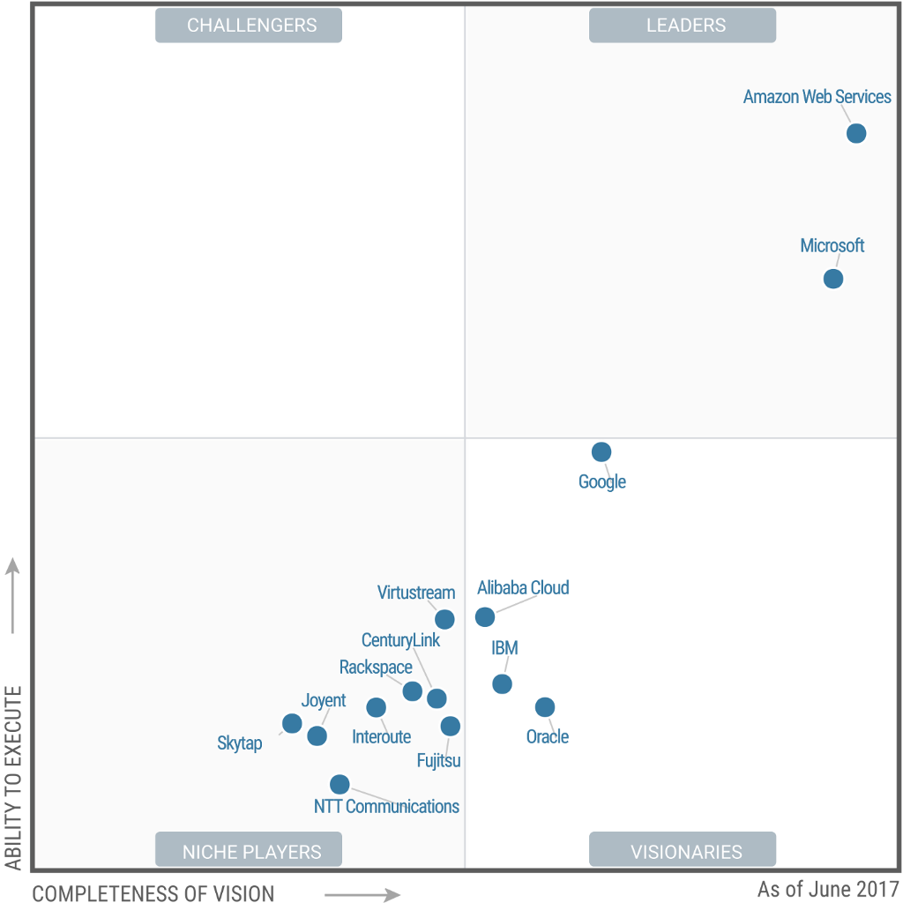
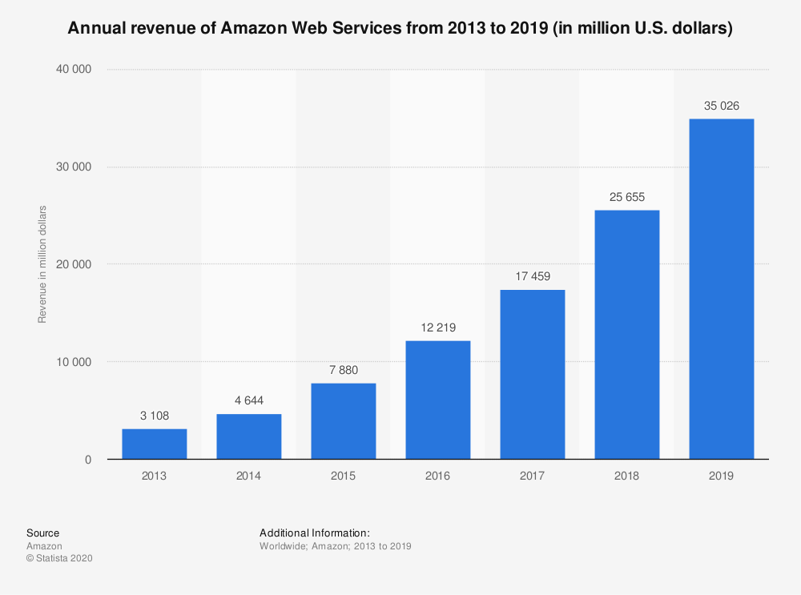

# Cloud Provider Amazon Web Services (AWS)

Amazon Web Services (AWS) is a public cloud provider that started publicly available cloud services in 2006 
as a pioneer and continues to lead the market with innovations to this day. 
AWS has been the market leader in IaaS providers for 10 years and is the leader in Gartner's Magic Quadrant 
for Cloud IaaS for the seventh year in a row [^ 1].

In addition to the classic IaaS products such as virtual machines (Elastic Cloud Compute (EC2)), 
Storage (Elastic Block Storage (EBS)), Object Storage (S3), 
AWS also offers all higher cloud service levels such as CaaS, PaaS and FaaS products. 
Moreover, the AWS catalog also includes important ancillary services such as domain hosting (Route53), 
SSL certificates (Certificate Manager (ACM)) and content delivery network (S3 + CloudFront). 
Resources in the Amazon Cloud can be connected directly to your own data center via dedicated leased lines 
via Direct Connect.

AWS is represented worldwide in so-called regions, including six regions in Europe: 

* Ireland (2007)
* Germany (2014)
* United Kingdom (2016)
* France (2017)
* Sweden (2018)
* Italy (2020)

There are at least 2, mostly 3 independent data centers (Availability Zones) per region.
 
AWS tries to meet the special security and data protection requirements of German customers with a clear presence on 
German territory. In addition, AWS has received a C5 attestation for all services offered from the 
__Bundesamt für Information und Sicherheit (BSI)__ in accordance with the __Cloud Computing Compliance Catalog (C5)__ [^ 2].

According to Gartner, AWS remains the dominant market leader with an annual revenue of over USD 35 billion in 2019.

AWS continues to lead the competition clearly as a thought leader and reference for all competitors. 
The service portfolio, which is already rich in itself, grows with increasing speed by further innovative services. 
AWS is the preferred provider worldwide for the strategic adaptation of cloud technologies.

At the same time, Gartner rates AWS as the most mature, enterprise-ready provider with the most extensive capabilities 
to manage a large number of users and resources. This provider is therefore not only the first choice for customers 
who value innovation and want to implement systems of engagement, but also for customers who want to bring entire 
data centers to a public cloud.

AWS extensive service portfolio requires profound expert knowledge if you want to use the services sensibly and cost-effectively. 
AWS technical support is excellent, documentation is extensive, training is extensive, 
and there are a large number of partner companies that can assist you in using AWS services. 
Nevertheless, it must be clear to AWS customers that, after an easy start, it can be very challenging to continue 
to make optimal use of the portfolio in the future: The continuous introduction of new services, 
the constant release of new best practices and the ongoing changes in cost management require 
a high level of commitment from IT organizations just to keep pace.

The fine-granular price model is very flexible and complex, which makes it difficult to calculate the real costs. 
Therefore, it is therefore advisable to purchase a third-party cost management tool. 
In fairness, however, AWS offers the opportunity to negotiate your own contracts and discounts: 
Netflix as one of the largest AWS customers certainly does not pay the list prices from AWS 'service catalog, 
but has its own volume contracts.    

[^1]: 
    see [Gartner: Magic Quadrant for Cloud Infrastructure as a Service, Worldwide, 15.06.2017](https://www.gartner.com/doc/reprints?id=1-2G2O5FC&ct=150519&st=sb) 
    
[^2]: see [Amazon C5-Standard](https://aws.amazon.com/en/compliance/bsi-c5/)    
    