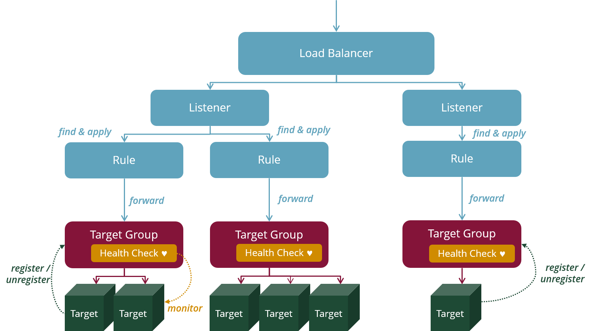

# AWS EC2 Basics

Here you will find a description of the most important terms and concepts to get you started quickly in the world of the AWS virtual machines.

## Terms and Concepts

### EC2 Instanz

Bei __EC2-Instanzen__ handelt es sich einfach um virtuelle Maschinen, die mit einem bestimmten Betriebssystem-Image - einem __Amazon Machine Image (AMI)__ - gestartet werden. Die Ausstattung der EC2-Instanz bestimmt man über einen vorgegebenen Instanztypen, der für einen bestimmten CPU-Anteil, einen bestimmten Hauptspeicher und einer bestimmten Netzbandbreite steht.

An EC2-Instanzen hängt man sogenannte Volumes - den Elastic Block Storage (EBS). Standardmäßig hat jede EC2-Instanz immer ein Root-Volume, auf dem sich das Bestriebssystem der Instanz befindet, man kann aber auch zusätzliche Volumes hinzufügen.

EC2-Instanzen lassen sich starten, stoppen und terminieren (entspricht dem Löschen). Die Ausstattung der EC2-Instanz kann später durch einen Wechsel auf einen anderen Instanztypen geändert werden.

Jede EC2-Instanz muss in einem Subnetz laufen. Die Art des Subnetzes bestimmt, ob die EC2-Instanz über eine öffentliche IP-Adresse oder nur über eine private IP-Adress erreichbar ist.

### [Amazon Machine Image (AMI)](http://docs.aws.amazon.com/AWSEC2/latest/UserGuide/AMIs.html)

Ein Amazon Machine Image (AMI) liefert die Informationen, wie eine EC2-Instanz in der Amazon Cloud gestartet werden soll und beinhaltet folgendes:

* Ein Template für das Root Volume der Instanz (zum Beispiel ein Betriebssystem, einen Application Server oder eine Applikation).
* Launch Permissions, die festlegen, wer mit diesem AMI eine EC2-Instanz starten darf.
* Ein Block Device Mapping, das definiert, welche Volumes an die Instanz geängt werden sollen.

AMIs werden sowohl von AWS als auch von Drittherstellern angeboten. Da AWS den Prozess und die Tools zum Erstellen von AMIs offen gelegt hat, kann sich jeder AWS-Kunden eigene AMIs bauen, diese mit anderen Kunden frei oder gegen Gebühren teilen. AWS bietet eigenen eigenen Marktplatz für den Austausch von AMIs an.

AWS bietet für alle gängigen Betriebsysteme selber AMIs an. Darunter befindet sich auch ein von Amazon gebündeltetes Amazon Linux.

### [Auto Scaling Group](http://docs.aws.amazon.com/autoscaling/latest/userguide/AutoScalingGroup.html)

Eine __Auto Scaling Group__ umfasst eine Anzahl von EC2-Instanzen, die ähnliche Charakteristiken aufweisen und eine logische Gruppe zur Scalierung und Verwaltung bilden sollen. Die Anzahl der EC2-Instanzen in einer Auto Scaling Group kann entweder manuell oder automatisch angepasst werden.

Dabei geschieht die automatische Anpassung meist auf Basis von CloudWatch Alarmen, die ausgelöst werden, wenn die Grenzwerte von bestimmten Metriken wie zum Beispiel CPU-Auslastung über- bzw. unterschritten werden. Für einen solchen CloudWatch-Alarm kann man dann Aktionen definieren, die durchgeführt werden sollen, wenn der Alarm ausgelöst wird. So kann zum Beispiel der Alarm "CPU-Auslastung über 75% für die letzte Minute" zu einer Erhöhung der Instanz-Anzahl in der Auto Scaling Group führen. Das Starten der zusätzlichen Instanzen übernimmt dann eben die Auto Scaling Group auf der Basis von sogenannten Launch Configurations.  

### [Launch Configuration](http://docs.aws.amazon.com/autoscaling/latest/userguide/LaunchConfiguration.html)

Eine __Launch Configuration__ definiert die Charakteristiken einer EC2-Instanz, die innerhalb einer Auto Scaling Group gestartet werden soll. Zu diesen Charakteristiken gehören neben dem Instanz-Typ und dem AMI auch die Security Group, eine IAM-Instanz-Rolle (welche AWS-Dienste darf die EC2-Instanz ausführen), ein Schlüsselpaar für den SSH-Zugriff auf die Instant usw.

### Bastion Server

Ein Bastion Server ist eine einfache EC2-Instanz mit öffentlicher IP-Adresse, die über SSH aus dem Internet erreichbar ist. Normalerweise dienen Bastion Server ausschließlich nur dem Zweck, von außen die Instanzen im eigenen VPC administrieren zu können oder gar komplette Softwarepakete in das VPC hinein installieren zu können.

### [Application Load Balancer](http://docs.aws.amazon.com/elasticloadbalancing/latest/application/introduction.html)

Ein __Application Load Balancer__ ist ein von AWS angebotener virtueller redundanter, hochverfügbarer und horizontal skalierender Load Balancer, der sich für ein VPC provisionieren lässt. Für den Load Balancher selber bezahlt man dabei nichts sondern nur für den Traffic, der durch den Load Balancer geroutet wird.

Hier ein Überlick über einen derartigen Load Balancer:

Einem Load Balancer werden __Listener__ hinzugefügt. Jeder Listener definiert dabei ein Protokoll/Port-Paar, (z.B.: HTTP:80, HTTPS:443) auf das der Listener hört.

Jeder Listener verfügt über Regeln (__Rules__), die bestimmen, an welche Target Group der eingehende Request basierend auf dessen URL weitergeleitet werden soll. Dabei werden sowohl __Path Based Routing__ als auch __Host Based Routing__ unterstützt.

Eine __Target Group__ verwaltet nun eine Gruppe von Targets, an die er eingehende Request weitergeleitet werden soll. Es wird nur ein Target für die Bearbeitung des Requests ausgewählt. Für eine Target Group können __Health Checks__ definiert werden, anhand dessen der Zustand der Targets überwacht werden soll. Nur gesunde Targets erhalten Requests zur Verarbeitung.

Bei den __Targets__ handelt es sich schließlich um Applikationen auf EC2-Instanzen, die eingehende Requests von der Target Group zugeteilt bekommen. Die Applikationen können sich dynamisch bei einer Target-Group mit einer IP-Adresse und einer Portnummer registrieren oder werden manuell über die AWS-Konsole oder über die AWS
CLI einer Target Group hinzugefügt. Eine EC2-Instanz kann mehrmals in einer Target Group vorkommen, wenn sie mehrere Applikationen dieser Target Group hostet.

Bei einem Application Load Balancer lassen sich zwei Betriebsarten unterscheiden:

* Ein externer Application Load Balancer kann über ein Internet Gateway Requests aus dem Internet an Instanzen im VPC weiterleiten.
* Ein interner Application Load Balancer kann nur Traffic innerhalb eines VPCs weiterleiten.

Hier noch ein kleines Schaubild, das die Kommunikation über einen externen Application Load Balancer veranschaulichen soll:

Der Application Load Balancer muss mit einem öffentlichen Subnetz in jeder Availability Zone verknüpft werden, in der er an Targets routen soll.

Die Targets selber brauchen sich dann nicht mehr in öffentlichen Subnetzen befinden, sondern können auch in privaten Subnetzen laufen.

Requests aus dem Internet erhält der Application Load Balancer über das dem VPC zugeordnete Internet Gateway.

  