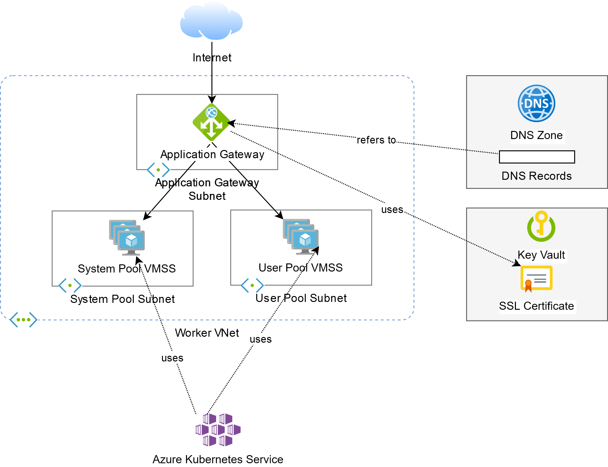

# Azure Kubernetes Service (AKS)

## Introduction

`Azure Kubernetes Service` or AKS is the Kubernetes as a Service offering of Microsoft Azure.
All master nodes of the Kubernetes cluster - or in other words: the control plane of the Kubernetes cluster - 
are managed by Azure. 
All you have to provide are the worker nodes usually hosted by [virtual machine scale sets](../vm/vm_basics.md#virtual-machine-scale-set).

## Simple AKS setup

The AKS cluster instance uses two node groups or pools implemented as [virtual machine scale sets](../vm/vm_basics.md#virtual-machine-scale-set):

* the `system node group` or `system pool` provides all worker nodes supposed to handle system workloads for cluster management etc.
* the `user node group` or `user pool` provides all worker nodes supposed to handle non-system workloads 
like applications, jobs and tool stacks for ingress, logging, monitoring and tracing.

Both VMSS use autoscaling to handle increasing or decreasing workload. 
To ensure high availability, all VMSS are spanning all availability zones (if present) and 
VMs are evenly distributed across the availability zones.

The VNet hosting the worker node groups contains at least three subnets:

* one subnet for the application gateway
* one subnet for the user node group or user pool
* one subnet for the system node group or system pool

An optional fourth subnet could host all DBaaS instances used by applications running on the cluster.

An [application gateway](../vnet/vnet_basics.md#application-gateway) acts as a level-7 loadbalancer in front of the AKS cluster.
It uses a SSL certificate created and managed by a key vault to terminate HTTPS. 
All incoming traffic is mainly forwarded to the user pool which is hosting the Traefik ingress controller.

A dedicated DNS zone manages all DNS records referring to external names of services hosted on the AKS cluster.
Each DNS record contained in the DNS zone points to the application gateway. The application gateways does all forwarding into the cluster. 

## Reference Setup for production-ready AKS clusters

The Azure documentation provides a reference setup called `Azure Kubernetes Service (AKS) production baseline`, which
can be used as a good starting point to set up AKS clusters in production.

A production-ready setup of an AKS cluster differs significantly from the simple setup mentioned before.
Please check [Azure Kubernetes Service (AKS) production baseline](https://docs.microsoft.com/en-us/azure/architecture/reference-architectures/containers/aks/secure-baseline-aks) for details.

@see [Azure Kubernetes Service (AKS) production baseline](https://docs.microsoft.com/en-us/azure/architecture/reference-architectures/containers/aks/secure-baseline-aks)

## Resources

[Azure Kubernetes Service (AKS)](https://docs.microsoft.com/en-us/azure/aks/) Official Azure Documentation