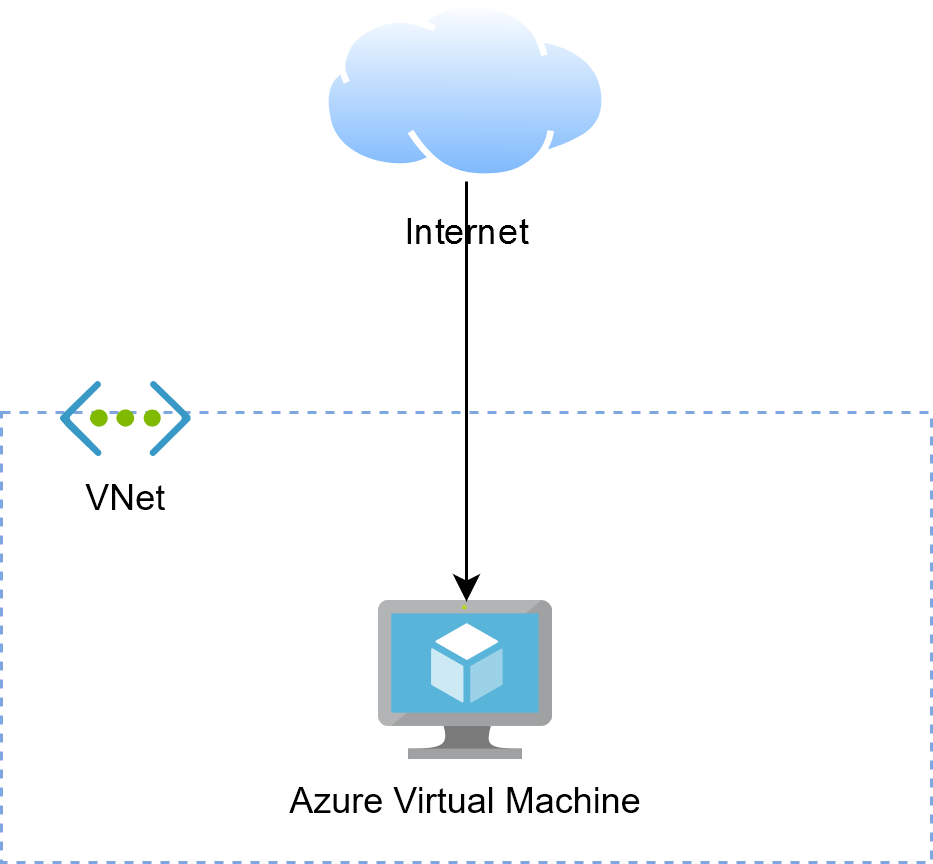

# Virtual Network Basics

## Azure Virtual Network (VNet)

Azure Virtual Network (VNet) is the fundamental building block for your private network in Azure.

Each VNet come with the following capabilities:

* Address space: each VNet has its own IP address space that you must specify upon creation.

* Subnets: allow you to segment your VNet into smaller networks with their own address space.

* Regions: a VNet is bound to a specific region but may communicate with VNet from other regions
through Virtual Network Peering

* Subscription: a VNet is associated with a subscription

All resources hosted in a VNet can communicate outbound to the internet by default. 
Inbound traffic from the internet to a resource is enabled by simply assigning a public IP address
to it.

@see [Terraform azurerm_virtual_network](https://www.terraform.io/docs/providers/azurerm/r/virtual_network.html)

## Subnets

`Subnets` allow you to segment your VNet into smaller networks with dedicated address spaces and tailored network access control
via network security groups.

A subnet spans all [availability zones](../az_get_started.md#availability-zones) of a [region](../az_get_started.md#region).
Although a subnet may have multiple address prefixes (CIDR blocks), it's always a good idea to thinks about how to
distribute your VNets address space among your subnets, before you actually create them.
Subnets must have distinct non-overlapping address prefixes.

@see [Terraform azurerm_subnet](https://www.terraform.io/docs/providers/azurerm/r/subnet.html)

## Network Security Groups

A `network security group` allows you to control network traffic inside your VNet on a subnet level.
By default, your subnets will not have any traffic restrictions. If you want to be more specific about which subnet is allowed
to talk to which other subnet you need to create a network security group and to attach it to the subnets.

A network security group consists of a set of rules which come in two different flavours: ingress rules control inbound traffic,
egress rules control outbound traffic. 
Each network security group has a set of default rules, which are automatically added to the group when it is created.
 
@see [Network security groups](https://docs.microsoft.com/de-de/azure/virtual-network/network-security-groups-overview)

@see [Terraform azurerm_network_security_group](https://www.terraform.io/docs/providers/azurerm/r/network_security_group.html)

## Application Security Groups

@see [Application security groups](https://docs.microsoft.com/de-de/azure/virtual-network/application-security-groups)

## NAT Gateways

A `NAT gateway` is an Azure service which offers a highly available and scalable NAT solution.

The NAT gateway can be attached to private subnets in a VNet. 
The internet-bound traffic of any resource within the private subnet is automatically routed to the attached NAT gateway
which having to add an explicit route to the subnets route table.

Each NAT gateway needs either a [public IP](#public-ip) or a [public IP prefix](#public-ip-prefix) to be able to translate private IP addresses into public ones.  

@see [Designing virtual networks with NAT gateway resources](https://docs.microsoft.com/de-de/azure/virtual-network/nat-gateway-resource)

@see [Terraform azurerm_nat_gateway](https://www.terraform.io/docs/providers/azurerm/r/nat_gateway.html)

## Public IP

A `public IP` defines a public IP address which may be allocated statically or dynamically.
Each resource that needs to be accessible from the internet must have a public IP address.

Of course, Azure supports IPv4 and IPv6 addresses.

@see [Public IP addresses](https://docs.microsoft.com/en-us/azure/virtual-network/public-ip-addresses)

@see [Terraform azurerm_public_ip](https://www.terraform.io/docs/providers/azurerm/r/public_ip.html)

## Public IP Prefix

A `public IP prefix` is a reserved contiguous range of static public IP addresses.
The actual contiguous IP addresses will be picked from the set of public IP addresses available in a [region](../az_get_started.md#region). 

The size of the static public IP address pool has to be determined when the public IP prefix is allocated.
A prefix of `/28` specified on creation for example will result in a public IP prefix with 16 public IP addresses.

@see [Public IP address prefix](https://docs.microsoft.com/en-us/azure/virtual-network/public-ip-address-prefix)

@see [Terraform azurerm_public_ip_prefix](https://www.terraform.io/docs/providers/azurerm/r/public_ip_prefix.html)

## Bastion 

`Azure Bastion` is an Azure service which enables you to access private resources in your VNet directly from the Azure Portal
using either RDP or SSH.

!!! danger
    If you want to add the Azure Bastion service to your VNet, you must add a subnet named `AzureBastionSubnet`!

@see [What is Azure Bastion?](https://docs.microsoft.com/en-us/azure/bastion/bastion-overview)

@see [Terraform azure_bastion_host](https://www.terraform.io/docs/providers/azurerm/r/bastion_host.html)