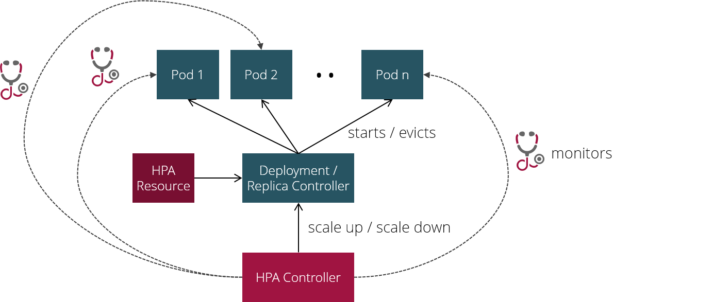
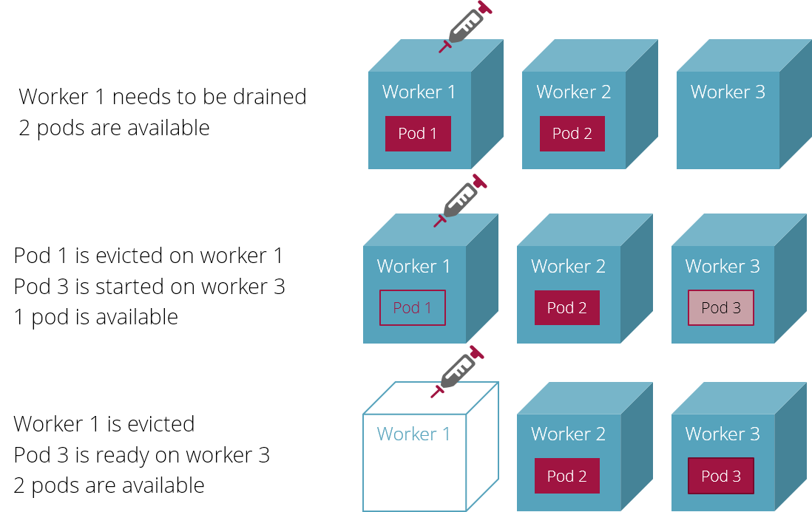
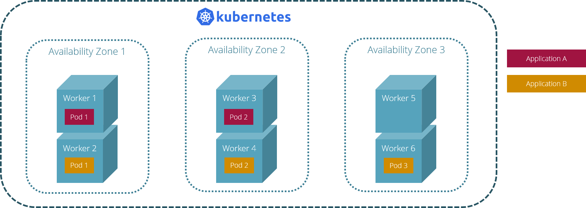

# Highly available applications with Kubernetes

These are additional resources you should know about when you want to run applications securely with high availability.

### DeploymentStrategy & RollingUpdateDeployment

The `deployment strategy` in a [deployment](k8s_basic_objects.md#deployment) specification determines, 
which strategy should be applied when updating deployments in order to rollout a new version of your application.

Kubernetes supports two deployments strategies:

* `RollingUpdate` (default): performs a rolling update by replacing the old pods one by one with the new pods (no downtime).
* `Recreate`: kill all old pods at once and start the new pods (downtime until the first new pod is available)

### DeploymentStrategy `RollingUpdate` (default)

In this strategy a new replica set is created for the new pods while the old replica set with the old pods is still up and running.
Now the new replica set is scaled up to one new pod. As soon as the new pod is ready, the old replica set is scaled 
down by one pod. This process is repeated until the specified number of new pods are available in the new replica set.
Finally, the old replica set is deleted.


Since traffic is routed to any available old or new pod, your application users will not experience any downtime.

!!! danger "Rolling updates require that old and new version can coexist"
    Since there is a period of time during a rolling update where the old and the new version of your application
    is in use at the same time, you will have to make sure that the version upgrade does not cause any disruptive change in
    your application's user experience!
    
### DeploymentStrategy `Recreate`: 

In this strategy, all old pods are terminated before the new pods are created and started. Since spinning up the new
pods may take some time, your application users will experience a short downtime.


 
### ReplicaSet

A `replica set` controls the specified number of identical [pods](k8s_basic_objects.md#pod) which are supposed to be available at any time.
These days, replica sets are supposed to be managed exclusively through [deployments](k8s_basic_objects.md#deployment) or [stateful sets](k8s_basic_objects.md#statefulset).

Although Kubernetes will restart dead or unhealthy pods automatically, you will experience a downtime, if you are running only one instance of your pod.
In order to ensure your application to be available at any time, you always will have to run at least 2 replicas of your pod.
  
@see [ReplicaSet](https://kubernetes.io/docs/concepts/workloads/controllers/replicaset/)

__Example: Scaling pods manually__

You can scale your deployment manually using `kubectl scale`:

```
kubectl scale deployment.v1.apps/cxp-hello-k8s --replicas=10
```

This will change the replica count in your deployment on Kubernetes, but not in the deployment manifest that
you used to install your application in the first place. To avoid this gap between the deployment manifest and 
the installed deployment, it's better to follow these steps:

1. Update `replicaCount` in your deployment manifest

1. Update the deployment on the cluster running `kubectl apply`

## HorizontalPodAutoscaler

A `horizontal pod autoscaler` (HPA) automatically scales the number of pods in a [deployment](k8s_basic_objects.md#deployment) 
or [stateful set](k8s_basic_objects.md#statefulset) depending on standard metrics like CPU or memory consumption or 
custom metrics provided by the application.
If the workload on an application increases the number of pods increases as well, if the workload on an application
decreases the number of pods decreases as well.

Like many features in Kubernetes, the horizontal pod autoscaler is implemented as a `controller` and a Kubernetes API `resource` or `object`.
Through a HPA `resource` you can define how the HPA `controller` should behave regarding your application:
Think of the HPA `resource` like a set of rules which the HPA `controller` uses to manage the elasticity of your application.



The HPA `controller` periodically (every 15 seconds by default) checks on each application with a HPA `resource`, if the 
current metrics of the application are within the expected range. If not, it decides on which action to take based on
a particular algorithm (see first reference below for details).
 
@see [HorizontalPodAutoscaler](https://kubernetes.io/docs/tasks/run-application/horizontal-pod-autoscale/)

@see [HorizontalPodAutoscaler Manifest Reference](https://kubernetes.io/docs/reference/generated/kubernetes-api/v1.20/#horizontalpodautoscaler-v2beta1-autoscaling)

__Example: HorizontalPodAutoscaler manifest__

This manifest file creates a HPA resource:

```yaml
apiVersion: autoscaling/v2beta1
kind: HorizontalPodAutoscaler
metadata:
  name: cxp-hello-k8s
  labels:
    app.kubernetes.io/name: cxp-hello-k8s
    app.kubernetes.io/instance: cxp-hello-k8s
spec:
  scaleTargetRef:
    apiVersion: apps/v1
    kind: Deployment
    name: cxp-hello-k8s
  minReplicas: 2
  maxReplicas: 4
  metrics:
    - type: Resource
      resource:
        name: cpu
        targetAverageUtilization: 80
    - type: Resource
      resource:
        name: memory
        targetAverageUtilization: 80
```

* it refers to a deployment `.spec.scaleTargetRef`.
* it scales up to a maximum of __4__ pod replicas (`.spec.maxReplicas`) and scales down to a minimum of __2__ pod replicas (`.spec.minReplicas`).
* it uses 80% CPU utilization and 80% memory utilization as threshold values for up- or downscaling.

## PodDisruptionBudget

A `pod disruption budget` (PDB) defines how many pods you expect to be up and running at any time even if the cluster
itself is under maintenance.

Typical cluster maintenance activities are:

* Version upgrade of a cluster which requires the replacement of all existing worker nodes with new worker nodes.
* Maintenance of a particular worker node, which requires the node to be drained 
(which means shifting all workload running on that node to other nodes in the cluster)

If a maintenance activity violates the defined PDBs, Kubernetes refuses to execute the command.

So as you can see a pod disruption in this context is not caused by some unexpected event inside your application
but by some expected or unexpected event concerning the platform your application is running on.

!!! info "Limitations of pod disruption budgets"
    A PDB cannot protect you from involuntary disruptions like node crashes etc!
    
@see [Disruptions](https://kubernetes.io/docs/concepts/workloads/pods/disruptions/)

@see [PodDisruptionBudget Manifest Reference](https://kubernetes.io/docs/reference/generated/kubernetes-api/v1.20/#poddisruptionbudget-v1beta1-policy)

__Example: PodDisruptionBudget manifest__

```yaml
apiVersion: policy/v1beta1
kind: PodDisruptionBudget
metadata:
  name: cxp-hello-k8s
  labels:
    app.kubernetes.io/name: cxp-hello-k8s
    app.kubernetes.io/instance: cxp-hello-k8s
spec:
  minAvailable: 1
  selector:
    matchLabels:
      app.kubernetes.io/name: cxp-hello-k8s
      app.kubernetes.io/instance: cxp-hello-k8s
```

A PDB has three fields:

* `.spec.selector`: a pod selector which defines to which pods the PDB applies.
* `.spec.minAvailable`: defines the number of selected pods which must be still available after eviction; 
can be either an absolute number or a percentage.   
* `.spec.maxUnavailable`: defines the number of selected pods which may be unavailable after eviction;
can be either an absolute number or a percentage. 

!!! tip "Always set your replicaCount > 1 if you are using PDBs"
    One regular gotcha when introducing PDBs is the minimum number of replicas you need to run if you
    want pod disruption budgets to work as expected. If you set `replicaCount` in your deployment to __1__
    and define a `minAvailable` value of __1__ in your pod disruption budget, Kubernetes will refuse to drain
    the node your pod is running on. So rule of thumb should be: always set replica count greater than one 
    when you want to set a PDB as well. 

__Example: PodDisruptionBudgets in action__



## Affinity

An `affinity` is part of the pod specification and defines rules 
why a pod should (*affinity*) or should not (*anti-affinity*) be assigned to a particular worker node.
This affinity language allows you to spread your pods across the cluster's worker nodes according to certain rules.

@see [Assigning Pods to Nodes](https://kubernetes.io/docs/concepts/scheduling-eviction/assign-pod-node/)

@see [Affinity PodSpec Reference](https://kubernetes.io/docs/reference/generated/kubernetes-api/v1.20/#affinity-v1-core)

Possible rules are:

* Never assign more than one pod replica of the same pod replica set to the same worker node: This rule ensures
that your application is always up, even if some nodes running your pods crash or are evicted.
* Never assign more than one pod replica of the same pod replica set to the same availability zone: This rule ensures
that your application even survives outages of a complete availability zone (assuming that your cluster spans multiple zones, of course)
* Colocate backend pod and database pod of your application on the same worker node: This rule ensures
optimum inter-pod communication between the backend and the database since both are running on the same machine.

__Example: Optimum redundancy on a cluster spanning multiple availability zones__



## Topology Spread Constraints

A `topology spread constraint` describes how a group of pods ought to spread across topology domains. 
Scheduler will schedule pods in a way which abides by the constraints. 
All topologySpreadConstraints are ANDed.
These constraints allow you to spread your pods across `availability zones` in a region of a public cloud provider 
which adds another level of resilience to your workload since your workload can survive even the outage of an 
availability zone now.

Topology spread constraints are defined within a [pod](./k8s_basic_objects.md#pod) template specification.

@see [Pod Topology Spread Constraints](https://kubernetes.io/docs/concepts/workloads/pods/pod-topology-spread-constraints/)

@see [TopologySpreadConstraint PodSpec Reference](https://kubernetes.io/docs/reference/generated/kubernetes-api/v1.20/#topologyspreadconstraint-v1-core)
  


    