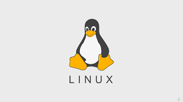

# Linux Introduction

## A world without Linux is hard to imagine

Here is why:
 
* Linux is the largest open-source project – in 2018, there were more than 20 million lines in the Linux kernel code.
* Every major space program uses Linux, including one of the SpaceX vehicles Falcon 9. Their software runs on Linux, and the language of choice is C++.
* According to Alexa’s count of the top 25 websites in the world, only 2 aren’t using Linux.
* 96.3% of the world’s top 1 million servers run on Linux. Only 1.9% use Windows, and 1.8% – FreeBSD.
* Linux has great applications for personal and small business financial management. GnuCash and HomeBank are the most popular ones.
* 90% of the public cloud workload runs on Linux.
* 90% of Hollywood’s special effects are made on Linux

Source: [111+ Linux Statistics and Facts – Linux Rocks!](https://hostingtribunal.com/blog/linux-statistics/#gref)

## Linux Facts (hopefully, cannot be sure these days!)

Here are some facts about Linux for 2019:
 
* Linux was launched on September 17, 1991, and it is 27 years old today.
* Linux is the OS of 1.63% of all desktop operating systems worldwide.
* In 2018, the market share of Linux in India was 3.97%.
* In 2018, Linux ran on 100% of the world’s 500 supercomputers.
* In 2018, the number of Linux games available on Steam reached 4,060.
* 19.5% of the global infotainment operating market in 2017 belonged to Linux.
* 95% of the servers that run the world’s top 1 million domains are powered by Linux.
* In 2018, Android dominated the mobile OS market with 75.16%.
* 85% of all smartphones are based on Linux.

Source: [111+ Linux Statistics and Facts – Linux Rocks!](https://hostingtribunal.com/blog/linux-statistics/#gref)

## Linux Distributions by Cloud Provider

Linux Distribution | AWS | Azure
--- | --- | ---
Amazon Linux | x |
[CentOS](https://centos.org) | x | x
[CoreOS](http://coreos.com/) |  | x 
[Debian](https://www.debian.org/) | x | x
[Kali](https://www.kali.org/) | x | 	 
[Oracle Linux](https://www.oracle.com/Linux/) |  | x
[Red Hat Enterprise Linux](https://www.redhat.com/en/technologies/linux-platforms/enterprise-linux) | x | x
[SUSE Linux Enterprise](https://www.suse.com/products/server/) | x | x
[Ubuntu](https://ubuntu.com/) | x | x

Comparison of available Linux distributions as advertised on providers homepage

Your favourite Linux distro is missing? Well bring your own with [Packer](https://packer.io) (see `Infrastructure as Code`)!

## So what Linux Distro are we going to use?

Well most of our stuff will be based on CentOS 7/8, some minor stuff on Fedora CoreOS since both are as close as it gets to Red Hat Enterprise Linux which our customers love.