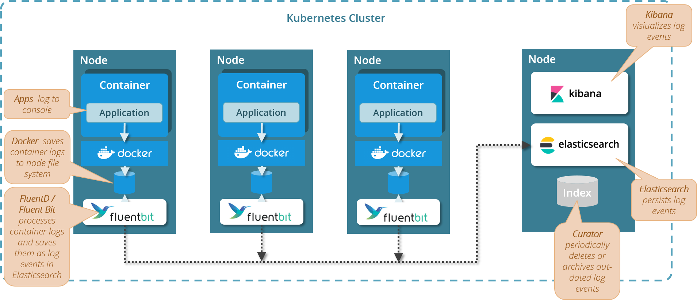

# Cluster Logging with EFK

## Motivation

All log entries written by applications must be stored in a centrally managed DB which can be queried for log events.

## Overview

A logging stack based on Elasticsearch, FluentD / FluentBit, Kibana (a.k.a. EFK stack) is an excellent choice for cluster logging:
 
* [FluentD](https://www.fluentd.org/) / [FluentBit](https://fluentbit.io/) 
collects all log events sent by applications, filters them, enriches them and promotes them to Elasticsearch
* [Elasticsearch](https://www.elastic.co/elasticsearch/) 
as a distributed database with a comprehensive set of analytical functions capable of dealing with huge data volumes, stores all log events
* [Kibana](https://www.elastic.co/kibana) visualizes log events stored in Elasticsearch through dashboards and queries

!!! info "Good news"
    You can keep your favourite logging framework as long as it is able to render log entries in JSON!

## Drilling Down: EFK on Kubernetes 

The following image shows all moving parts of a typical cluster logging stack on Kubernetes:

Each application running in a Docker container simply logs to console (stdout) in JSON format.

Docker writes all output to console as container logs to the filesystem of the Kubernetes node.

FluentD / Fluent Bit runs as an agent on each cluster node and continuously reads these container logs 
from the filesystem line by line. Each line is interpreted as a separate log event which is passed through
a processor pipeline which filters, transforms and enriches each log event. Last step of this processor
pipeline is to forward each log event to Elasticsearch.

Elasticsearch stores all log events in indices, usually one index per day.

Kibana offers a web UI to query for the log events stored in Elasticsearch and visualizes them in 
dashboards as tables or diagrams.

The Elasticsearch Curator runs as a cronjob which does some housekeeping on Elasticsearch by pruning old indices.

 

