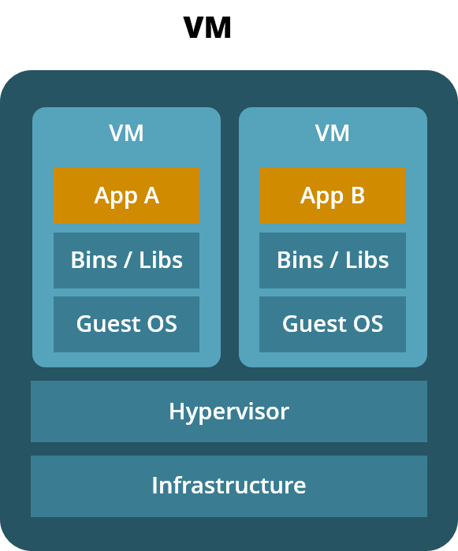

# Virtual Machines (on Windows)

## Motivation

There are times when Window 10 is not good enough. So in order to run other operating systems like your current one on 
your local machine or any machine you have to use virtualization. This section is going to provide you with 
essential information
* about the concept of virtualization through virtual machines
* about the options to create and run virtual machines on your local windows machine

## Virtualization through virtual machines

Virtual machines (VMs) are an abstraction of physical hardware turning one server into many servers. The hypervisor (on Windows Hyper-V or Oracle Virtual Box) allows multiple VMs to run on a single machine. Each VM includes a full copy of an operating system, the application, necessary binaries and libraries - taking up tens of GBs. VMs can also be slow to boot.

In our context, the guest operating system will mostly be Centos 8 or Centos 7.

